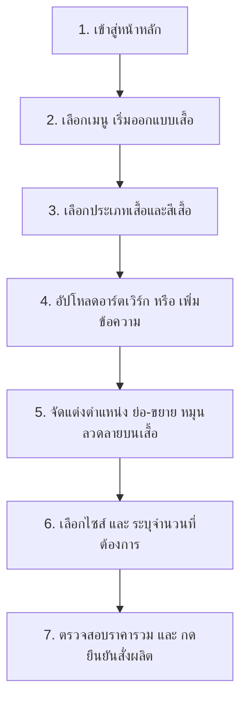

# VICTO — แพลตฟอร์มสั่งผลิตและออกแบบเสื้อผ้าพรีเมียมแบบ Premium Print-on-Demand (POD) Apparel Platform

ยินดีต้อนรับสู่ **VICTO** แพลตฟอร์มอีคอมเมิร์ซระดับ MERN Stack ที่พัฒนาขึ้นเพื่อตอบโจทย์ธุรกิจออกแบบและสั่งผลิตเสื้อผ้าสำเร็จรูปเกรดพรีเมียมแบบพิมพ์ตามสั่ง (Premium Print-on-Demand Apparel Platform) ไม่มีขั้นต่ำ พร้อมแดชบอร์ดจัดการเทมเพลตดีไซน์ส่วนตัว และเครื่องมือจำลองการดีไซน์แบบโต้ตอบเสมือนจริง (Interactive Customizer Component) ที่ใช้งานง่ายและไหลลื่นบนทุกอุปกรณ์

---

## 👕 รูปแบบธุรกิจ (Business Model)

VICTO ดำเนินธุรกิจในรูปแบบ **Premium Print-on-Demand (POD) Apparel Platform** โดยมีจุดขายหลักดังนี้:
*   **Premium Apparel & Custom Templates**: มุ่งเน้นผลิตภัณฑ์เครื่องแต่งกายคัดสรรพิเศษเกรดพรีเมียม ครอบคลุมเสื้อยืด Unisex Atelier Tee, เสื้อฮู้ดหนานุ่ม Signature Luxe Hoodie, และเสื้อสเวตเตอร์ Premium Crew Sweatshirt โดยเปิดโอกาสให้ลูกค้าบันทึกผลงานการออกแบบเก็บเป็น "แม่แบบสินค้าส่วนตัว (Product Templates)" เพื่อนำกลับมาสั่งผลิตหรือปรับแก้ในภายหลังได้โดยง่าย
*   **No Minimum Order & Dropshipping**: รองรับการสั่งซื้อและผลิตเสื้อไม่มีขั้นต่ำ แม้เพียง 1 ตัว ก็พร้อมส่งผลิตและจัดส่งทันที เหมาะสำหรับแบรนด์เสื้อผ้าแฟชั่นอิสระ, ยูนิฟอร์มองค์กรลุคหรูหรา และสตรีทแวร์
*   **Atelier Colorway & Multi-Side Printing**: ตัวเลือกสีกรรมวิธีพิเศษ (Atelier Colorway) พร้อมความสามารถการวางอาร์ตเวิร์กและอักษรข้อความได้ถึง 4 ด้านอิสระ (ด้านหน้า, ด้านหลัง, ปลายแขนซ้าย, ปลายแขนขวา) แยก Canvas ออกจากกันโดยสมบูรณ์
*   **Diverse Printing Tech**: นำเสนอเทคโนโลยีพิมพ์ลายพรีเมียม ได้แก่ DTF (Direct to Film) สีสันสดชัดไล่เฉดละมุน, Sublimation คมลึก, งานปักประณีต (Embroidery), และการสกรีนไฮเอนด์ (Screen Printing)

---

## 🖱️ ขั้นตอนการใช้งานสำหรับลูกค้า (User Guide)

ลูกค้าสามารถสั่งออกแบบเสื้อทีมของตนเองผ่านขั้นตอนการทำงานที่ง่ายและเป็นขั้นเป็นตอนดังนี้:



### ขั้นตอนโดยละเอียด:
1.  **การเลือกรูปแบบเสื้อ**: ในแท็บ **"รูปแบบ"** ของหน้าต่างเครื่องมือออกแบบ ลูกค้าสามารถเลือกทรงเสื้อที่ต้องการ (คอกลม, โปโล, สายเดี่ยว, แขนยาว) และสามารถเลือกสีเสื้อที่ต้องการจากแถบพาเลทสีมาตรฐาน 12 เฉดสี
2.  **การออกแบบลวดลาย**:
    *   *อัปโหลดอาร์ตเวิร์ก*: ไปที่แท็บ **"อาร์ตเวิร์ก"** เพื่ออัปโหลดไฟล์ภาพของตนเอง (รองรับ PNG, JPG, SVG ขนาดไม่เกิน 5MB)
    *   *เพิ่มข้อความชื่อทีม*: ไปที่แท็บ **"ข้อความ"** พิมพ์คำที่ต้องการ เลือกฟอนต์ดีไซน์ (เช่น Bebas, Anton, Archivo Black) และเลือกสีตัวอักษร
3.  **การควบคุมเลเยอร์แบบเรียลไทม์**: ลูกค้าสามารถเลือกเลเยอร์อาร์ตเวิร์กหรือตัวอักษรเพื่อปรับแต่งได้ตามอิสระ:
    *   ลากเลเยอร์เพื่อจัดตำแหน่งบนหน้าเสื้อหรือหลังเสื้อ
    *   ย่อขยายขนาด (Scale) และหมุนลวดลาย (Rotate) ได้ตามความต้องการ
    *   จัดเรียงระดับทับซ้อน (Z-Index) ขึ้นหน้าสุด (Bring Forward) หรือลงหลังสุด (Send Backward)
4.  **ระบุไซส์และจำนวน**: ในแท็บ **"สั่งซื้อ"** ลูกค้าสามารถเลือกไซส์เสื้อ (XS ถึง 3XL) และระบุจำนวนผลิตต่อไซส์ ระบบจะคำนวณราคาสรุปรวมให้ทันทีแบบเรียลไทม์

---

## 🛠️ เจาะลึกทางเทคนิค (Tech Deep Dive)

### 1. โครงสร้างสถาปัตยกรรม (Architecture)
VICTO ถูกสร้างขึ้นด้วยสถาปัตยกรรม **MERN Stack** ที่ผสมผสานเครื่องมือหน้าบ้านประสิทธิภาพสูง **Vue 3 (Data Reactivity)** และ **Fabric.js (Interactive Canvas)** ร่วมกับหลังบ้าน **Node.js/Express** ทำให้ระบบประมวลผลการจัดวางเลเยอร์และบันทึกข้อมูลได้อย่างไหลลื่นไร้รอยต่อ:

```
apps/
  api/          # หลังบ้านควบคุม Express Server & API และการติดต่อ MongoDB
  web/          # หน้าบ้านระดับ Atelier ดีไซน์ด้วย Tailwind CSS โหลดผ่านเซิร์ฟเวอร์
```

*   **Express API Server**: เสิร์ฟ Static Files ของหน้าบ้านทั้งหมด และสร้าง API endpoint สำหรับความปลอดภัย (Auth), ข้อมูลสินค้าเสื้อผ้า (Products), ลูกค้า (Users), และการสร้าง/สืบค้น/ลบเทมเพลตดีไซน์ (Product Templates)
*   **MongoDB (`custom-shop`)**: เก็บข้อมูลผ่าน Mongoose ODM โดยแบ่งเป็น 4 คอลเลกชันหลักคือ:
    *   [User.js](file:///c:/Workspace/week03/VIBE-CODE-MY-ECOMMERCE/apps/api/models/User.js): ข้อมูลสมาชิก สิทธิ์ และที่อยู่
    *   [Product.js](file:///c:/Workspace/week03/VIBE-CODE-MY-ECOMMERCE/apps/api/models/Product.js): ข้อมูลรายละเอียดของแบบเสื้อ ราคากลาง และรูปภาพ
    *   [ProductTemplate.js](file:///c:/Workspace/week03/VIBE-CODE-MY-ECOMMERCE/apps/api/models/ProductTemplate.js): บันทึกข้อมูลแม่แบบเสื้อผ้าดีไซน์พิเศษ 4 มุมมอง พร้อมรูปภาพ Thumbnail พรีวิว
    *   [Order.js](file:///c:/Workspace/week03/VIBE-CODE-MY-ECOMMERCE/apps/api/models/Order.js): บันทึกคำสั่งผลิตเสื้อยืดทีม พร้อมเก็บข้อมูลการเลือกไซส์และอิมเมจของแบบพิมพ์ลาย

### 2. โครงสร้างโค้ดหน้าบ้านแบบ Single Page Component (SPA Paradigm)
*   **Vue 3 & HTML Template String**: ไฟล์หน้าจอคัสตอมเสื้อ [custom-shirt.html](file:///c:/Workspace/week03/VIBE-CODE-MY-ECOMMERCE/apps/web/custom-shirt.html) ทำหน้าที่เป็นเพียง Loader Shell เปล่าเพื่อประสิทธิภาพความเร็วสูงสุด ขณะที่โครงสร้าง DOM และการจับคู่ข้อมูลความต้องการแบบเรียลไทม์ทั้งหมดถูกรวบรวมไว้ภายใต้ไฟล์ [custom-shirt.js](file:///c:/Workspace/week03/VIBE-CODE-MY-ECOMMERCE/apps/web/js/custom-shirt.js) ในรูปแบบ Template Component 
*   **Fabric.js & Snapping Guidelines**: การย้ายตำแหน่ง เลเยอร์งานพิมพ์ ย่อขยาย หมุนลวดลาย ดำเนินการผ่านแคนวาสเวกเตอร์ของ Fabric.js พร้อมระบบไกด์ไลน์กึ่งกลางดึงดูดแนวตั้ง/แนวนอน (Center Snapping Guidelines) เพื่อความเป๊ะระดับพรีเมียม
*   **Isolated Workspace States**: ระบบจะทำการ Serialize ข้อมูลแคนวาสของแต่ละด้านเสื้อเก็บลงในโมเดลแยกกันแบบเรียลไทม์ ทำให้ผู้ใช้สามารถออกแบบลายหน้า หลัง และแขนเสื้อแยกกันได้อิสระโดยข้อมูลไม่หายหรือปะปนกัน
*   **ERP Order Preview**: ตัวระบบ ERP ใน [erp.js](file:///c:/Workspace/week03/VIBE-CODE-MY-ECOMMERCE/apps/web/js/erp.js) ของแอดมินหลังร้าน จะดึงรูปพรีวิว Base64 ของดีไซน์มาแสดงผลคู่กับรายการสั่งซื้อ เพื่อตรวจสอบความถูกต้องก่อนผลิตจริงส่งโรงพิมพ์
*   **ระบบ Export ข้อมูล**: มีคำสั่งแปลงออเดอร์เสื้อเป็นโครงสร้าง CSV โดยการใช้สตริงด้วย UTF-8 BOM (`\uFEFF`) เพื่อให้โปรแกรม Excel เปิดภาษาไทยได้โดยไม่เพี้ยน

### 3. ระบบความสวยงามระดับพรีเมียม (Design Tokens, Glassmorphism & Animations)
*   **Custom Design Tokens**: ควบคุมธีมและตัวแปรหลักผ่านไฟล์ [tokens.css](file:///c:/Workspace/week03/VIBE-CODE-MY-ECOMMERCE/apps/web/css/tokens.css) ซึ่งเก็บค่าสี HSL ธีมมืด (Dark Mode), รัศมีความมน (Border Radius), และรูปแบบเงา
*   **Glassmorphism (ดีไซน์กระจกฝ้า)**: การ์ดพรีวิวสินค้า การ์ดฟิลเตอร์ และกล่องเครื่องมือออกแบบ ใช้สไตล์กระจกฝ้าโดยผสมผสานคุณสมบัติ `background: rgba(...)` ร่วมกับ `backdrop-filter: blur(...)` และเส้นขอบประกายอ่อน ๆ
*   **Dynamic Animations & Micro-interactions**:
    *   *Scroll Reveal*: การเปิดเผยองค์ประกอบต่าง ๆ ของหน้าเว็บทีละนิดเมื่อเลื่อนหน้าจอลงมา โดยใช้ `IntersectionObserver` ในไฟล์ [store.js](file:///c:/Workspace/week03/VIBE-CODE-MY-ECOMMERCE/apps/web/js/store.js)
    *   *Floating & Glowing Effects*: การตั้งค่า Keyframe Animations ใน CSS เพื่อสร้างเอฟเฟกต์เสื้อยืดลอยตัวอย่างช้า ๆ และการกระจายแสงพื้นหลัง (Background Orbs)

---

## 💿 ขั้นตอนการติดตั้งและรันระบบ (Setup & Installation)

ตรวจสอบให้แน่ใจว่าเครื่องคอมพิวเตอร์ของคุณมี **Node.js** และ **MongoDB** ติดตั้งและกำลังทำงานอยู่

### 1. ตั้งค่าไฟล์หลังบ้าน (API Configuration)
1.  เปิดไปที่โฟลเดอร์หลังบ้าน:
    ```powershell
    cd apps/api
    ```
2.  ตรวจสอบหรือสร้างไฟล์ `.env` และกำหนดค่า URI เชื่อมต่อ MongoDB และ Port:
    ```env
    PORT=3000
    MONGO_URI=mongodb://localhost:27017/custom-shop
    JWT_SECRET=customshop_secret_key_2026
    ```

### 2. ติดตั้ง Dependencies และรัน Seed ข้อมูลเสื้อสินค้า
1.  ติดตั้งโปรแกรมไลบรารีที่จำเป็นทั้งหมด:
    ```powershell
    npm install
    ```
2.  ทำการเคลียร์ฐานข้อมูลและนำเข้าข้อมูลสินค้าเสื้อยืดเริ่มต้นใหม่เพื่อใช้ทดสอบระบบ:
    ```powershell
    node seed.js
    ```

### 3. รันระบบเซิร์ฟเวอร์
เริ่มต้นเซิร์ฟเวอร์ในโหมดพัฒนา (Development Mode):
```powershell
npm run dev
```

เปิดเบราว์เซอร์และเข้าไปที่ **[http://localhost:3000](http://localhost:3000)** เพื่อเข้าใช้บริการร้านค้าและลองออกแบบเสื้อตัวแรกของคุณ! สำหรับส่วนของการจัดการหลังร้านของแอดมิน ให้ไปที่เมนู **เข้าสู่ระบบ** หรือที่ลิงก์ **[http://localhost:3000/erp](http://localhost:3000/erp)**
