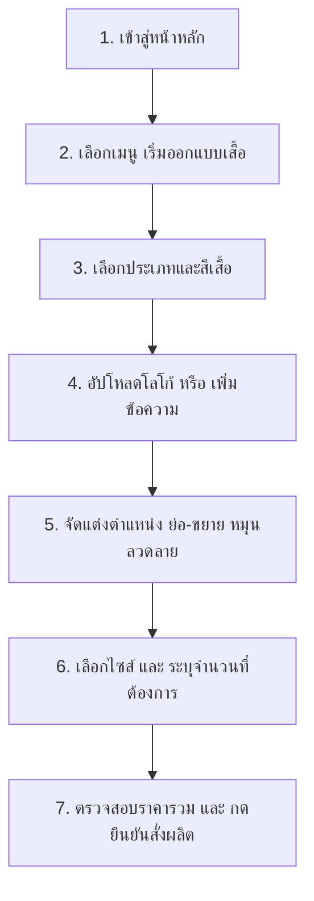

# VICTO — แพลตฟอร์มสั่งผลิตและออกแบบเสื้อทีมแบบ Custom Print-on-Demand (POD)

ยินดีต้อนรับสู่ **VICTO** แพลตฟอร์มอีคอมเมิร์ซระดับ Greenfield MERN Stack ที่พัฒนาขึ้นเพื่อตอบโจทย์ธุรกิจสั่งผลิตเสื้อทีมและจัดทำโล่รางวัล/เหรียญรางวัลแบบครบวงจร โดยเน้นไปที่ระบบการสั่งผลิตแบบพิมพ์ตามสั่ง (Print-on-Demand) ไม่มีขั้นต่ำ และเครื่องมือจำลองการออกแบบเสมือนจริงบนหน้าเว็บที่ทรงประสิทธิภาพและใช้งานง่ายบนทุกอุปกรณ์

---

## 👔 รูปแบบธุรกิจ (Business Model)

VICTO ดำเนินธุรกิจในรูปแบบ **Print-on-Demand (POD) และ Customization** โดยมีจุดขายหลักดังนี้:
*   **No Minimum Order**: ลูกค้าสามารถออกแบบและสั่งซื้อสินค้าเพียง 1 ตัว หรือ 1 ชิ้นก็ผลิตให้ได้ทันที เหมาะสำหรับเสื้อทีมขนาดเล็ก ทีมกีฬา E-Sports เสื้อพนักงานบริษัท หรืองานอีเวนต์เฉพาะกิจ
*   **T-shirt Focus & Versatility**: เน้นกลุ่มผลิตภัณฑ์เสื้อผ้าสำเร็จรูปคุณภาพสูงเป็นหลัก (Premium Cotton 100% ทรง Unisex) ครอบคลุมเสื้อยืด (Tee), เสื้อโปโล (Polo), เสื้อสายเดี่ยว (Tank), และเสื้อแขนยาว (Long) พร้อมทั้งรองรับสินค้าของขวัญรางวัล เช่น ถ้วยรางวัล (Trophy), เหรียญรางวัล (Medal), สายรัดข้อมือ (Wristband) และเข็มกลัด (Badge)
*   **Diverse Printing Tech**: นำเสนอเทคโนโลยีการจัดทำโลโก้และลวดลายที่ตอบโจทย์หลากหลาย ได้แก่:
    *   *DTF (Direct to Film)*: สีสันสดคมชัด ไล่เฉดสีได้ระดับภาพถ่าย เหมาะกับงานพิมพ์ที่มีลวดลายละเอียดสูง
    *   *Sublimation*: พิมพ์สีซึมเข้าเนื้อผ้า เหมาะสำหรับเสื้อกีฬาพิมพ์ลายทั้งตัว
    *   *การปักโลโก้ (Embroidery)*: ลุคหรูหรา เรียบร้อย ทนทานเป็นพิเศษ เหมาะกับยูนิฟอร์มองค์กร
    *   *การสกรีนไฮเอนด์ (Screen Printing)*: เหมาะสำหรับการสั่งผลิตปริมาณมากเพื่อความคุ้มค่าสูงสุด

---

## 🖱️ ขั้นตอนการใช้งานสำหรับลูกค้า (User Guide)

ลูกค้าสามารถสั่งออกแบบเสื้อทีมของตนเองผ่านขั้นตอนการทำงานที่ง่ายและเป็นขั้นเป็นตอนดังนี้:



### ขั้นตอนโดยละเอียด:
1.  **การเลือกรูปแบบพื้นฐาน**: ในแท็บ **"รูปแบบ"** ของหน้าต่างเครื่องมือออกแบบ ลูกค้าสามารถเลือกทรงเสื้อที่ต้องการ (คอกลม, โปโล, สายเดี่ยว, แขนยาว) และสามารถเลือกสีเสื้อที่ต้องการจากแถบพาเลทสีมาตรฐาน 12 เฉดสี
2.  **การออกแบบลวดลาย**:
    *   *อัปโหลดอาร์ตเวิร์ก*: ไปที่แท็บ **"อาร์ตเวิร์ก"** เพื่ออัปโหลดไฟล์ภาพของตนเอง (รองรับ PNG, JPG, SVG ขนาดไม่เกิน 5MB) โดยสามารถเลือกจัดวางแบบโปร่งใส (Transparent Background) เพื่อความสวยงามสูงสุด
    *   *เพิ่มข้อความสโลแกน*: ไปที่แท็บ **"ข้อความ"** พิมพ์คำที่ต้องการ เลือกรูปแบบฟอนต์ดีไซน์ (เช่น Bebas, Anton, Archivo Black) และเลือกสีฟอนต์ตามต้องการ
3.  **การควบคุมเลเยอร์แบบเรียลไทม์**: ลูกค้าสามารถเลือกเลเยอร์อาร์ตเวิร์กหรือตัวอักษรเพื่อปรับแต่งได้ตามอิสระ:
    *   ลากเลเยอร์เพื่อจัดตำแหน่งบนหน้าหรือหลังเสื้อ
    *   ใช้ปุ่มลัดด่วนหรือลากมุมเพื่อ **ย่อขยายขนาด (Scale)** และ **หมุนลวดลาย (Rotate)**
    *   จัดเรียงระดับทับซ้อน (Z-Index) ขึ้นหน้าสุด (Bring Forward) หรือลงหลังสุด (Send Backward)
4.  **ระบุไซส์และจำนวนสั่งผลิต**: ในแท็บ **"สั่งซื้อ"** ลูกค้าสามารถเลือกไซส์เสื้อ (XS ถึง 3XL) และระบุจำนวนผลิตต่อไซส์ ระบบจะคำนวณราคาสรุปรวมและส่วนลดค่าจัดส่งให้ทันทีแบบเรียลไทม์

---

## 🛠️ เจาะลึกทางเทคนิค (Tech Deep Dive)

### 1. โครงสร้างสถาปัตยกรรม (Architecture)
VICTO ถูกสร้างขึ้นด้วยสถาปัตยกรรม **MERN Stack** ที่ลดทอนความซับซ้อนของหน้าบ้านโดยใช้ **Vanilla DOM Manipulation** ร่วมกับหลังบ้าน **Node.js/Express** ทำให้ระบบดาวน์โหลดและประมวลผลได้อย่างรวดเร็วมาก:

```
apps/
  api/          # หลังบ้านควบคุม Express Server & API และการติดต่อ MongoDB
  web/          # หน้าบ้าน Plain HTML, CSS และ Javascript ปราศจาก JS Framework
```

*   **Express API Server**: เสิร์ฟ Static Files ของหน้าบ้านทั้งหมด และสร้าง API endpoint สำหรับความปลอดภัย (Auth), ข้อมูลสินค้า (Products), ลูกค้า (Users), และการทำสรุปข้อมูลระบบสำหรับแอดมิน (Dashboard & Orders)
*   **MongoDB (`custom-shop`)**: เก็บข้อมูลผ่าน Mongoose ODM โดยแบ่งเป็น 3 คอลเลกชันหลักคือ:
    *   [User.js](file:///c:/Workspace/week03/VIBE-CODE-MY-ECOMMERCE/apps/api/models/User.js): ข้อมูลสมาชิก สิทธิ์ และที่อยู่
    *   [Product.js](file:///c:/Workspace/week03/VIBE-CODE-MY-ECOMMERCE/apps/api/models/Product.js): ข้อมูลรายละเอียดของสินค้า ราคากลาง และรูปภาพ
    *   [Order.js](file:///c:/Workspace/week03/VIBE-CODE-MY-ECOMMERCE/apps/api/models/Order.js): บันทึกข้อมูลคำสั่งซื้อ พร้อม Snapshot ข้อมูลลูกค้าและที่อยู่ขณะสั่งซื้อ เพื่อป้องกันผลกระทบจากการอัปเดตข้อมูลผู้ใช้ในภายหลัง

### 2. โครงสร้างโค้ดหน้าบ้านแบบ Vanilla (Vanilla Code Structure)
เพื่อให้การทำงานเป็นไปตามแนวคิดดั้งเดิมที่เบาและมีประสิทธิภาพที่สุด หน้าบ้านไม่ได้ใช้เฟรมเวิร์กอย่าง React/Vue แต่เลือกใช้เทคโนโลยี Web Standard ในการจัดการเหตุการณ์และสถานะ (State):
*   **Pointer Events API & FileReader**: ระบบจำลองการย้ายตำแหน่ง (Drag), การย่อขยาย (Resize), และการหมุน (Rotate) ของลวดลายบนตัวเสื้อในไฟล์ [custom-shirt.js](file:///c:/Workspace/week03/VIBE-CODE-MY-ECOMMERCE/apps/web/js/custom-shirt.js) ถูกเขียนด้วย Javascript ดิบ โดยใช้ `PointerEvent` ร่วมกับ `FileReader` ในการอ่านข้อมูลอิมเมจแบบ Base64 เข้าสู่หน่วยความจำ
*   **ERP Single Page Application (SPA)**: ตัวระบบ ERP ของแอดมินในไฟล์ [erp.js](file:///c:/Workspace/week03/VIBE-CODE-MY-ECOMMERCE/apps/web/js/erp.js) ควบคุมการเปลี่ยนหน้าจอและการจัดการ Element ใน DOM โดยใช้ฟังก์ชันเรนเดอร์ร่วมกับ `innerHTML` และดึงข้อมูลแบบ Asynchronous จาก API ด้วย `fetch()`
*   **ระบบ Export ข้อมูล**: มีคำสั่งแปลงอาเรย์ออบเจกต์คำสั่งซื้อและสินค้าเป็นโครงสร้าง CSV โดยการแปลงข้อมูลสตริงด้วย UTF-8 BOM (`\uFEFF`) เพื่อให้โปรแกรม Microsoft Excel หรือ Google Sheets สามารถเปิดภาษาไทยได้โดยไม่เกิดปัญหาฟอนต์เพี้ยน

### 3. ระบบความสวยงามระดับพรีเมียม (Design Tokens, Glassmorphism & Animations)
VICTO มอบประสบการณ์ระดับพรีเมียมแก่ผู้ใช้ตั้งแต่แรกเห็นผ่านแนวทางการดีไซน์ที่หรูหรา:
*   **Custom Design Tokens**: ควบคุมธีมและตัวแปรหลักผ่านไฟล์ [tokens.css](file:///c:/Workspace/week03/VIBE-CODE-MY-ECOMMERCE/apps/web/css/tokens.css) ซึ่งเก็บค่าสี HSL ที่จัดสรรมาอย่างลงตัว, โทนสีมืดที่เป็น Sleek Dark Mode, ค่ารัศมีความมน (Border Radius), และรูปแบบเงาที่นุ่มนวลเป็นธรรมชาติ
*   **Glassmorphism (ดีไซน์กระจกฝ้า)**: การ์ดพรีวิวสินค้า การ์ดฟิลเตอร์ และกล่องเครื่องมือออกแบบ ใช้สไตล์กระจกฝ้าโดยผสมผสานคุณสมบัติ `background: rgba(...)` ร่วมกับ `backdrop-filter: blur(...)` และเส้นขอบประกายอ่อน ๆ ช่วยสร้างมิติและความหรูหราทันสมัย
*   **Dynamic Animations & Micro-interactions**:
    *   *Scroll Reveal*: การเปิดเผยองค์ประกอบต่าง ๆ ของหน้าเว็บทีละนิดเมื่อเลื่อนหน้าจอลงมา โดยใช้ `IntersectionObserver` ในไฟล์ [store.js](file:///c:/Workspace/week03/VIBE-CODE-MY-ECOMMERCE/apps/web/js/store.js)
    *   *Floating & Glowing Effects*: การตั้งค่า Keyframe Animations ใน CSS เพื่อสร้างเอฟเฟกต์เสื้อยืดลอยตัวอย่างช้า ๆ และการกระจายแสงพื้นหลัง (Background Orbs) ช่วยให้หน้าเว็บรู้สึกมีชีวิตชีวาและดึงดูดสายตา

---

## 💿 ขั้นตอนการติดตั้งและรันระบบ (Setup & Installation)

ตรวจสอบให้แน่ใจว่าเครื่องคอมพิวเตอร์ของคุณมี **Node.js** และ **MongoDB** ติดตั้งและกำลังทำงานอยู่

### 1. โคลนและตั้งค่าฐานข้อมูล
นำเข้าข้อมูลโครงสร้างและข้อมูลจำลองของคอลเลกชันต่าง ๆ จากโฟลเดอร์เก็บข้อมูลโมเดลและ Seed ดั้งเดิม:
```
C:\Workspace\week02\1st-meet-dbs\03_my-ecommerce-project\
```

### 2. ตั้งค่าไฟล์หลังบ้าน (API Configuration)
1.  เปิดไปที่โฟลเดอร์หลังบ้าน:
    ```powershell
    cd apps/api
    ```
2.  ตรวจสอบหรือสร้างไฟล์ `.env` และกำหนดค่า URI เชื่อมต่อ MongoDB และ Port:
    ```env
    PORT=3000
    MONGO_URI=mongodb://localhost:27017/custom-shop
    JWT_SECRET=customshop_secret_key_2026
    ```

### 3. ติดตั้ง Dependencies และรัน Seed ข้อมูลสินค้า
1.  ติดตั้งโปรแกรมไลบรารีที่จำเป็นทั้งหมด:
    ```powershell
    npm install
    ```
2.  ทำการเคลียร์ฐานข้อมูลสินค้าและนำเข้าข้อมูลสินค้าเริ่มต้นใหม่เพื่อใช้ทดสอบระบบ:
    ```powershell
    node seed.js
    ```

### 4. รันระบบเซิร์ฟเวอร์
เริ่มต้นเซิร์ฟเวอร์ในโหมดพัฒนา (Development Mode) เพื่อคอยตรวจสอบไฟล์การเขียนโค้ดและรีสตาร์ทอัตโนมัติ:
```powershell
npm run dev
```

เปิดเบราว์เซอร์และเข้าไปที่ **[http://localhost:3000](http://localhost:3000)** เพื่อเข้าใช้บริการร้านค้าและลองออกแบบเสื้อตัวแรกของคุณ! สำหรับส่วนของการจัดการหลังร้านของแอดมิน ให้ไปที่เมนู **เข้าสู่ระบบ** หรือที่ลิงก์ **[http://localhost:3000/erp](http://localhost:3000/erp)**
