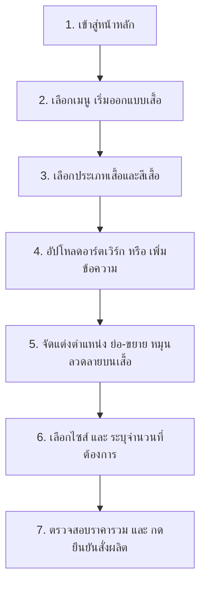

# VICTO — แพลตฟอร์มสั่งผลิตและออกแบบเสื้อทีมแบบ Custom Print-on-Demand (POD)

ยินดีต้อนรับสู่ **VICTO** แพลตฟอร์มอีคอมเมิร์ซระดับ MERN Stack ที่พัฒนาขึ้นเพื่อตอบโจทย์ธุรกิจสั่งผลิตเสื้อทีมแบบพิมพ์ตามสั่ง (Print-on-Demand) ไม่มีขั้นต่ำ และเครื่องมือจำลองการออกแบบเสื้อทีมเสมือนจริงบนหน้าเว็บที่ใช้งานง่ายบนทุกอุปกรณ์

---

## 👕 รูปแบบธุรกิจ (Business Model)

VICTO ดำเนินธุรกิจในรูปแบบ **Print-on-Demand (POD) และ Custom Apparel** โดยมีจุดขายหลักดังนี้:
*   **No Minimum Order**: ลูกค้าสามารถออกแบบและสั่งผลิตเสื้อเพียง 1 ตัว ก็ผลิตและส่งให้ได้ทันที เหมาะสำหรับเสื้อทีมขนาดเล็ก ทีมกีฬา E-Sports เสื้อพนักงานบริษัท หรืองานอีเวนต์เฉพาะกิจ
*   **Apparel Focus**: มุ่งเน้นผลิตภัณฑ์เสื้อผ้าคุณภาพสูง ครอบคลุมเสื้อยืด (Tee), เสื้อโปโล (Polo), เสื้อสายเดี่ยว (Tank), และเสื้อแขนยาว (Long) ทรง Unisex ใส่สบาย ผลิตจากผ้า Cotton 100% เกรดพรีเมียม
*   **Diverse Printing Tech**: นำเสนอเทคโนโลยีการจัดทำโลโก้และลวดลายบนเสื้อที่หลากหลาย ได้แก่:
    *   *DTF (Direct to Film)*: สีสันสดคมชัด ไล่เฉดสีได้ระดับภาพถ่าย เหมาะกับลายพิมพ์ละเอียดสูง
    *   *Sublimation*: พิมพ์สีซึมเข้าเนื้อผ้า เหมาะสำหรับเสื้อกีฬาพิมพ์ลายทั้งตัว
    *   *การปักโลโก้ (Embroidery)*: ลุคเรียบร้อย ทนทานเป็นพิเศษ เหมาะกับยูนิฟอร์มองค์กร
    *   *การสกรีนไฮเอนด์ (Screen Printing)*: เหมาะสำหรับการสั่งผลิตเสื้อทีมจำนวนมากเพื่อความคุ้มค่าสูงสุด

---

## 🖱️ ขั้นตอนการใช้งานสำหรับลูกค้า (User Guide)

ลูกค้าสามารถสั่งออกแบบเสื้อทีมของตนเองผ่านขั้นตอนการทำงานที่ง่ายและเป็นขั้นเป็นตอนดังนี้:



### ขั้นตอนโดยละเอียด:
1.  **การเลือกรูปแบบเสื้อ**: ในแท็บ **"รูปแบบ"** ของหน้าต่างเครื่องมือออกแบบ ลูกค้าสามารถเลือกทรงเสื้อที่ต้องการ (คอกลม, โปโล, สายเดี่ยว, แขนยาว) และสามารถเลือกสีเสื้อที่ต้องการจากแถบพาเลทสีมาตรฐาน 12 เฉดสี
2.  **การออกแบบลวดลาย**:
    *   *อัปโหลดอาร์ตเวิร์ก*: ไปที่แท็บ **"อาร์ตเวิร์ก"** เพื่ออัปโหลดไฟล์ภาพของตนเอง (รองรับ PNG, JPG, SVG ขนาดไม่เกิน 5MB)
    *   *เพิ่มข้อความชื่อทีม*: ไปที่แท็บ **"ข้อความ"** พิมพ์คำที่ต้องการ เลือกฟอนต์ดีไซน์ (เช่น Bebas, Anton, Archivo Black) และเลือกสีตัวอักษร
3.  **การควบคุมเลเยอร์แบบเรียลไทม์**: ลูกค้าสามารถเลือกเลเยอร์อาร์ตเวิร์กหรือตัวอักษรเพื่อปรับแต่งได้ตามอิสระ:
    *   ลากเลเยอร์เพื่อจัดตำแหน่งบนหน้าเสื้อหรือหลังเสื้อ
    *   ย่อขยายขนาด (Scale) และหมุนลวดลาย (Rotate) ได้ตามความต้องการ
    *   จัดเรียงระดับทับซ้อน (Z-Index) ขึ้นหน้าสุด (Bring Forward) หรือลงหลังสุด (Send Backward)
4.  **ระบุไซส์และจำนวน**: ในแท็บ **"สั่งซื้อ"** ลูกค้าสามารถเลือกไซส์เสื้อ (XS ถึง 3XL) และระบุจำนวนผลิตต่อไซส์ ระบบจะคำนวณราคาสรุปรวมให้ทันทีแบบเรียลไทม์

---

## 🛠️ เจาะลึกทางเทคนิค (Tech Deep Dive)

### 1. โครงสร้างสถาปัตยกรรม (Architecture)
VICTO ถูกสร้างขึ้นด้วยสถาปัตยกรรม **MERN Stack** ที่ลดทอนความซับซ้อนของหน้าบ้านโดยใช้ **Vanilla DOM Manipulation** ร่วมกับหลังบ้าน **Node.js/Express** ทำให้ระบบทำงานได้อย่างรวดเร็ว:

```
apps/
  api/          # หลังบ้านควบคุม Express Server & API และการติดต่อ MongoDB
  web/          # หน้าบ้าน Plain HTML, CSS และ Javascript ปราศจาก JS Framework
```

*   **Express API Server**: เสิร์ฟ Static Files ของหน้าบ้านทั้งหมด และสร้าง API endpoint สำหรับความปลอดภัย (Auth), ข้อมูลสินค้าเสื้อผ้า (Products), ลูกค้า (Users), และการทำสรุปข้อมูลระบบสำหรับแอดมิน (Dashboard & Orders)
*   **MongoDB (`custom-shop`)**: เก็บข้อมูลผ่าน Mongoose ODM โดยแบ่งเป็น 3 คอลเลกชันหลักคือ:
    *   [User.js](file:///c:/Workspace/week03/VIBE-CODE-MY-ECOMMERCE/apps/api/models/User.js): ข้อมูลสมาชิก สิทธิ์ และที่อยู่
    *   [Product.js](file:///c:/Workspace/week03/VIBE-CODE-MY-ECOMMERCE/apps/api/models/Product.js): ข้อมูลรายละเอียดของแบบเสื้อ ราคากลาง และรูปภาพ
    *   [Order.js](file:///c:/Workspace/week03/VIBE-CODE-MY-ECOMMERCE/apps/api/models/Order.js): บันทึกข้อมูลคำสั่งทำเสื้อยืดทีม พร้อมเก็บ Snapshot ข้อมูลลูกค้าและที่อยู่ขณะสั่งซื้อ

### 2. โครงสร้างโค้ดหน้าบ้านแบบ Vanilla (Vanilla Code Structure)
*   **Pointer Events API & FileReader**: ระบบจำลองการย้ายตำแหน่ง (Drag), การย่อขยาย (Resize), และการหมุน (Rotate) ของลวดลายบนตัวเสื้อในไฟล์ [custom-shirt.js](file:///c:/Workspace/week03/VIBE-CODE-MY-ECOMMERCE/apps/web/js/custom-shirt.js) ถูกเขียนด้วย Javascript ดิบ โดยใช้ `PointerEvent` ร่วมกับ `FileReader` ในการอัปโหลดไฟล์ภาพของผู้ใช้
*   **ERP Single Page Application (SPA)**: ตัวระบบ ERP ของแอดมินในไฟล์ [erp.js](file:///c:/Workspace/week03/VIBE-CODE-MY-ECOMMERCE/apps/web/js/erp.js) ควบคุมการเปลี่ยนหน้าจอและการจัดการ Element ใน DOM โดยใช้ฟังก์ชันเรนเดอร์ร่วมกับ `innerHTML` และดึงข้อมูลคำสั่งทำเสื้อทั้งหมดผ่าน API
*   **ระบบ Export ข้อมูล**: มีคำสั่งแปลงออเดอร์เสื้อเป็นโครงสร้าง CSV โดยการใช้สตริงด้วย UTF-8 BOM (`\uFEFF`) เพื่อให้โปรแกรม Excel เปิดภาษาไทยได้โดยไม่เพี้ยน

### 3. ระบบความสวยงามระดับพรีเมียม (Design Tokens, Glassmorphism & Animations)
*   **Custom Design Tokens**: ควบคุมธีมและตัวแปรหลักผ่านไฟล์ [tokens.css](file:///c:/Workspace/week03/VIBE-CODE-MY-ECOMMERCE/apps/web/css/tokens.css) ซึ่งเก็บค่าสี HSL ธีมมืด (Dark Mode), รัศมีความมน (Border Radius), และรูปแบบเงา
*   **Glassmorphism (ดีไซน์กระจกฝ้า)**: การ์ดพรีวิวสินค้า การ์ดฟิลเตอร์ และกล่องเครื่องมือออกแบบ ใช้สไตล์กระจกฝ้าโดยผสมผสานคุณสมบัติ `background: rgba(...)` ร่วมกับ `backdrop-filter: blur(...)` และเส้นขอบประกายอ่อน ๆ
*   **Dynamic Animations & Micro-interactions**:
    *   *Scroll Reveal*: การเปิดเผยองค์ประกอบต่าง ๆ ของหน้าเว็บทีละนิดเมื่อเลื่อนหน้าจอลงมา โดยใช้ `IntersectionObserver` ในไฟล์ [store.js](file:///c:/Workspace/week03/VIBE-CODE-MY-ECOMMERCE/apps/web/js/store.js)
    *   *Floating & Glowing Effects*: การตั้งค่า Keyframe Animations ใน CSS เพื่อสร้างเอฟเฟกต์เสื้อยืดลอยตัวอย่างช้า ๆ และการกระจายแสงพื้นหลัง (Background Orbs)

---

## 💿 ขั้นตอนการติดตั้งและรันระบบ (Setup & Installation)

ตรวจสอบให้แน่ใจว่าเครื่องคอมพิวเตอร์ของคุณมี **Node.js** และ **MongoDB** ติดตั้งและกำลังทำงานอยู่

### 1. ตั้งค่าไฟล์หลังบ้าน (API Configuration)
1.  เปิดไปที่โฟลเดอร์หลังบ้าน:
    ```powershell
    cd apps/api
    ```
2.  ตรวจสอบหรือสร้างไฟล์ `.env` และกำหนดค่า URI เชื่อมต่อ MongoDB และ Port:
    ```env
    PORT=3000
    MONGO_URI=mongodb://localhost:27017/custom-shop
    JWT_SECRET=customshop_secret_key_2026
    ```

### 2. ติดตั้ง Dependencies และรัน Seed ข้อมูลเสื้อสินค้า
1.  ติดตั้งโปรแกรมไลบรารีที่จำเป็นทั้งหมด:
    ```powershell
    npm install
    ```
2.  ทำการเคลียร์ฐานข้อมูลและนำเข้าข้อมูลสินค้าเสื้อยืดเริ่มต้นใหม่เพื่อใช้ทดสอบระบบ:
    ```powershell
    node seed.js
    ```

### 3. รันระบบเซิร์ฟเวอร์
เริ่มต้นเซิร์ฟเวอร์ในโหมดพัฒนา (Development Mode):
```powershell
npm run dev
```

เปิดเบราว์เซอร์และเข้าไปที่ **[http://localhost:3000](http://localhost:3000)** เพื่อเข้าใช้บริการร้านค้าและลองออกแบบเสื้อตัวแรกของคุณ! สำหรับส่วนของการจัดการหลังร้านของแอดมิน ให้ไปที่เมนู **เข้าสู่ระบบ** หรือที่ลิงก์ **[http://localhost:3000/erp](http://localhost:3000/erp)**
